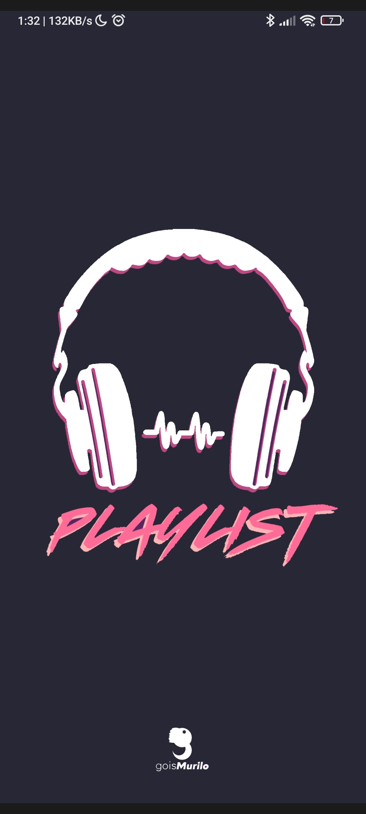
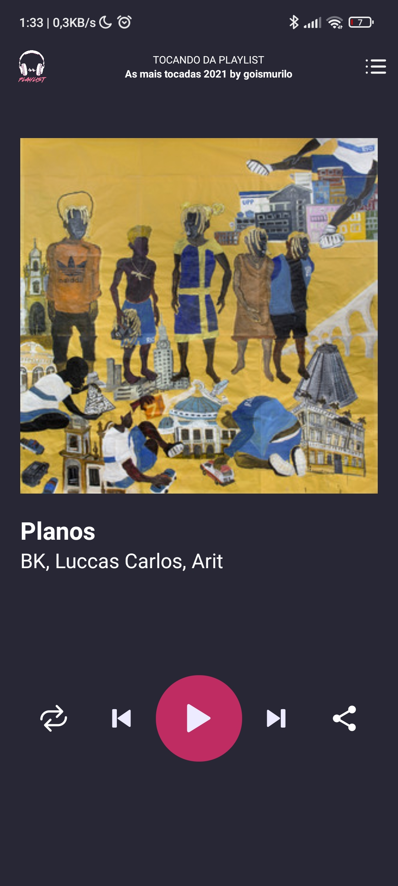
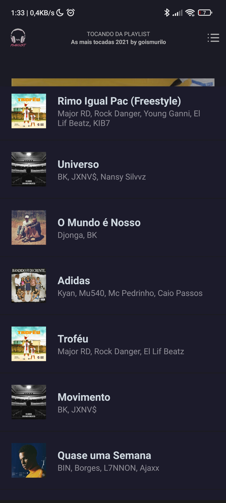

## 📦 O que é o projeto?

Esse repositório foi feito para serem aplicados alguns conceitos aprendidos sobre o framework React Native. 

O objetivo foi criar uma playlist de <i>previews</i> das músicas mais ouvidas pelo <a href="https://www.linkedin.com/in/goismurilo/"><b>dono desse repositório</b></a> no streaming de aúdio Spotify.

    
    
    

## 🚀 Tecnologias 

Esse projeto foi construído com a ajuda dessa Tecnologias:

- [TypeScript][typescript]
- [ReactNative][rn]
- [Expo][expo]
- [Yarn][yarn]

## ⚙ Como rodar o projeto

### `yarn ou npm i`

Dependendo do seu gerenciador de pacotes, você pode digitar algum desses comandos no seu terminal para o baixar os pacotes necessários, isso vai criar altomaticamente a página `node_modules`.

### `yarn start`

Esse comando vai iniciar o projeto no seu navegador no modo de desenvolvedor. Abra [http://localhost:3000](http://localhost:3000) para ver o resultado no browser. Será necessário mudar o ip no arquivo [api.ts](./src/services/api.ts) para a faixa de Ip da sua rede, leia mais [aqui](https://blogmasterwalkershop.com.br/arduino/descobrindo-a-faixa-de-ip-do-seu-roteador).

### `yarn api:server`

Esse comando vai iniciar o servidor fake. O projeto vai consumir os dados presentes no arquivo **db.json** que está na raiz do projeto.

## 🤝🏾 Como contribuir

Para contribuir basta clicar no botão **fork**, criar um **Branch**, arrumar o código e enviá-lo com **Pull Requests**.

Mais detalhes de como contribuir e em enviar Pull Requests em [GitHub Collaborating]("https://docs.github.com/en/pull-requests/collaborating-with-pull-requests")  

## 📃 Licença

This project is under the MIT license. See the [LICENSE](https://github.com/goismurilo/digital-cast/blob/main/LICENSE) for details.

Feito com ♥ por Murilo Gois :wave: [Get in touch!](https://www.linkedin.com/in/goismurilo/)

[typescript]: https://www.typescriptlang.org/
[expo]: https://expo.io/
[rn]: https://facebook.github.io/react-native/
[yarn]: https://yarnpkg.com/